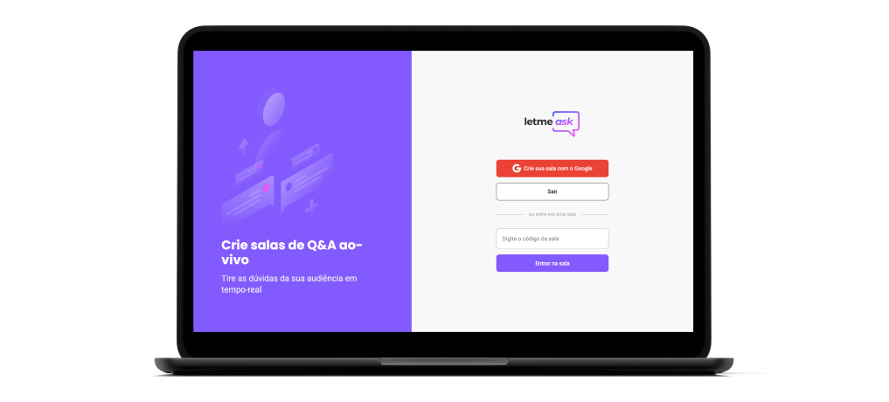

<h1 align="center">
  
</h1>

<h4 align="center"> 
  Next Level Week #06 - Let Me Ask
</h4>

  
  
  
  
  
  

## Índice

* [Índice](#índice)
* [Sobre](#sobre)
  * [Tecnologias](#principais-tecnologias-utilizadas)
* [Instalação local](#instalação-local)
* [Créditos](#créditos)
* [Licença](#licença)

## Sobre

O projeto foi desenvolvido na trilha React da sexta edição do evento Next Level Week, edição também chamada de NLW Together, proporcionado pela empresa [Rocketseat](https://rocketseat.com.br/). Baseou-se em um [layout](https://www.figma.com/community/file/1009824839797878169/Letmeask) elaborado no Figma.

O sistema, desenvolvido em TypeScript, é composto de um [site](https://ecoleta.marcel099.vercel.app/) em React e um Back-End como Serviço no [Firebase](https://firebase.google.com/).

### Principais tecnologias utilizadas

O sistema foi desenvolvido em TypeScript. É composto de 2 partes:

- Back-End
  - [Firebase](https://firebase.google.com/) - [Authentication](https://firebase.google.com/docs/auth) e [Realtime Database](https://firebase.google.com/docs/database)
- Front-End Web
  - [Next](https://nextjs.org/)
  - [React](https://react.dev/)
  - [SCSS](https://sass-lang.com/)

O maior diferencial deste projeto é o uso do [Firebase](https://firebase.google.com/), um Back-End como Serviço.

## Instalação local

Passos para atingir isso podem ser conferidos <a href="./INSTALLATION.md">neste arquivo</a>.

## Créditos

Credito a elaboração do modelo do banner deste documento e do banner social ao autor desconhecido desta [postagem](https://mckups.com/pixel-4-and-pixelbook-go-mockup/) no site [Mckups](https://mckups.com). Foi adaptado por mim de acordo com as características deste projeto.

## Licença

Este projeto está sob a licença MIT. Para maiores detalhes acesse o <a href="./LICENSE.md">arquivo de licença</a>.
